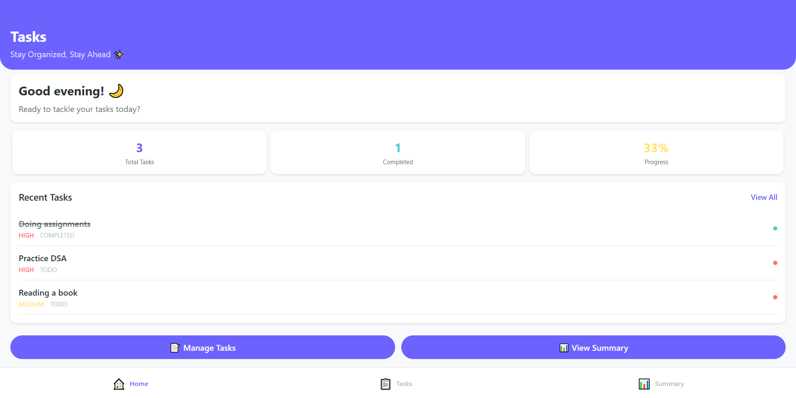
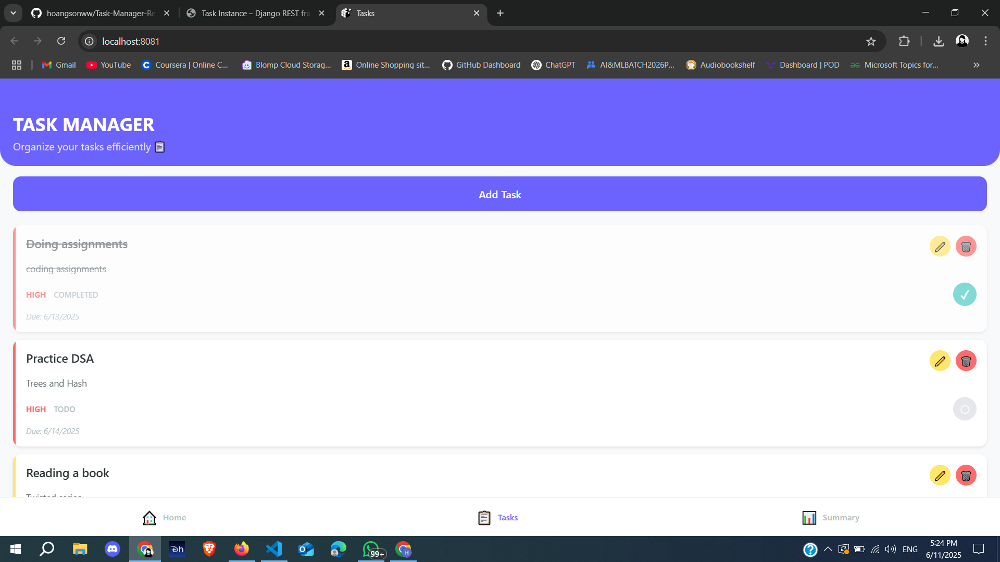
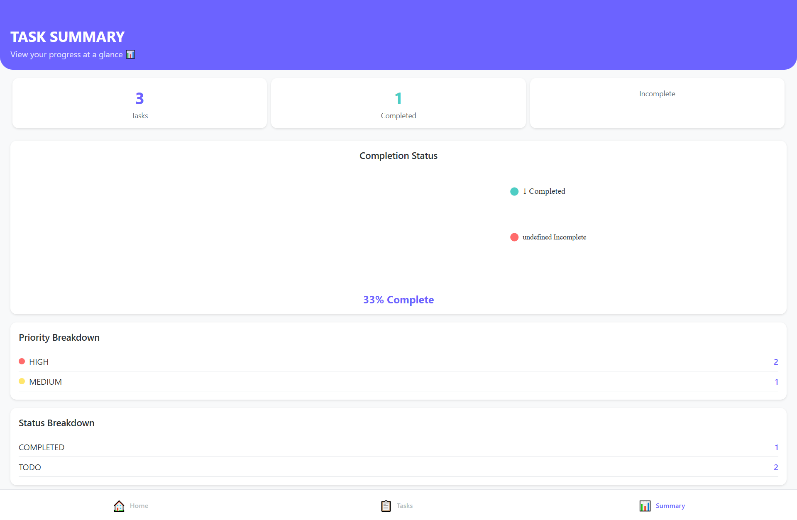
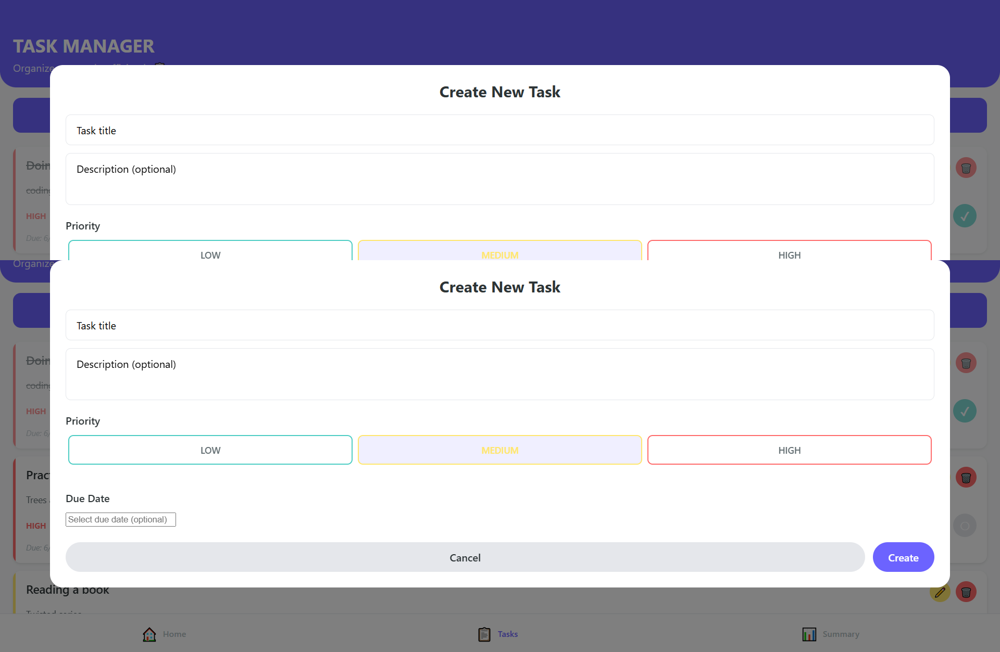

# Task Manager Application

A full-stack task management application with a Django REST API backend and React Native/Expo frontend.



## 📱 Screenshots

<div align="center">
  
  
  
</div>

## ✨ Features

- **Task Management**: Create, edit, delete, and mark tasks as complete
- **Priority Levels**: Assign low, medium, or high priority to tasks
- **Status Tracking**: Track task status (todo, in progress, completed)
- **Due Dates**: Set and manage due dates for tasks
- **Dashboard**: View task statistics and completion rates
- **Responsive Design**: Works on web and mobile platforms

## 🛠️ Tech Stack

### Backend
- Django 5.2.3
- Django REST Framework 3.16.0
- SQLite (development)

### Frontend
- React Native 0.79.3
- Expo 53.0.11
- TypeScript
- React Navigation
- Axios for API communication

## 🗂️ Project Structure

```
task-manager/
├── backend/                 # Django REST API
│   └── task_manager/        # Django project
│       ├── tasks/           # Tasks app
│       └── task_manager/    # Project settings
│
├── frontend/                # React Native app
│   └── task/
│       ├── src/             # Source code
│       │   ├── components/  # Reusable components
│       │   ├── screens/     # Screen components
│       │   ├── services/    # API services
│       │   ├── styles/      # Global styles
│       │   └── types/       # TypeScript type definitions
│       ├── assets/          # Images and assets
│       └── App.tsx          # Main app component
│
└── README.md                # Project documentation
```

## 🚀 Getting Started

### Prerequisites

- Node.js (v18+)
- Python (v3.10+)
- Expo CLI
- Git

### Backend Setup

```bash
# Clone the repository
git clone https://github.com/yourusername/task-manager.git
cd task-manager

# Create and activate virtual environment
python -m venv venv
source venv/bin/activate  # On Windows: venv\Scripts\activate

# Install dependencies
pip install -r requirements.txt

# Navigate to Django project
cd backend/task_manager

# Run migrations
python manage.py migrate

# Start development server
python manage.py runserver
```
The backend API will be available at http://localhost:8000/api/
```
# Navigate to frontend directory
cd frontend/task

# Install dependencies
npm install

# Start Expo development server
npm start
```
### 📝 Usage
Managing Tasks
- Create Task: Tap the "Add Task" button to create a new task
- Edit Task: Tap the edit (pencil) icon on any task to modify it
- Delete Task: Tap the delete (trash) icon to remove a task
- Complete Task: Tap the circle icon to mark a task as complete/incomplete

#### Created with ❤️ by [Himanshi Gupta]